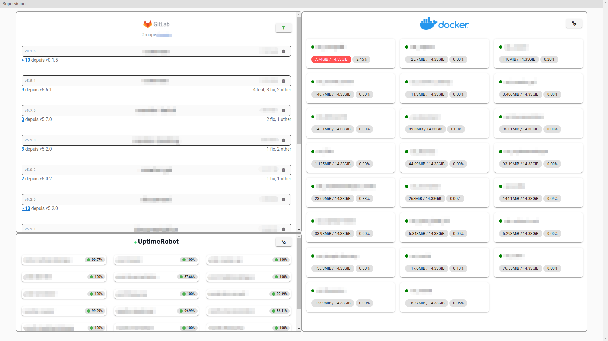

# Supervision



## Clone the repository

```bash
git clone https://github.com/kernoeb/supervision
cd supervision
```

## Development (website)

```bash
# Install dependencies
yarn install
# Run the development server, with hot reloading
yarn dev
```

## Build Setup (website)

```bash
# Install dependencies
yarn install

# Generate the static website
yarn generate
```

## Build Setup (packages)

```bash
# Install dependencies
yarn install

# Build the package, with pkg
yarn build_docker_monitor
yarn build_uptime_monitor
cd pkg || exit 1
```

## Usage (docker monitor package)

The package is a binary executable, which can be used to run the Docker supervision tool.  
Some environment variables are required to use the package:

```bash
SSH_PASS=xxxx SSH_KEY=~/.ssh/xxxxx SSH_HOST=xxx.xxx.xx SSH_USER=xxx SSH_PORT=xx ./docker-monitor
```

> SSH_HOST is the hostname of the SSH server  
> SSH_USER is the username of the SSH server  
> SSH_PORT is the port of the SSH server, default is 22 (optional)  
> SSH_KEY is the path to the SSH key  
> SSH_PASS is the passphrase of the SSH key (optional)  

## Usage (uptime robot monitor package)

The package is a binary executable, which can be used to run the Uptime Robot supervision tool.  
Some environment variables are required to use the package:

```bash
API_KEY=xxxxx ./uptime-monitor
```
